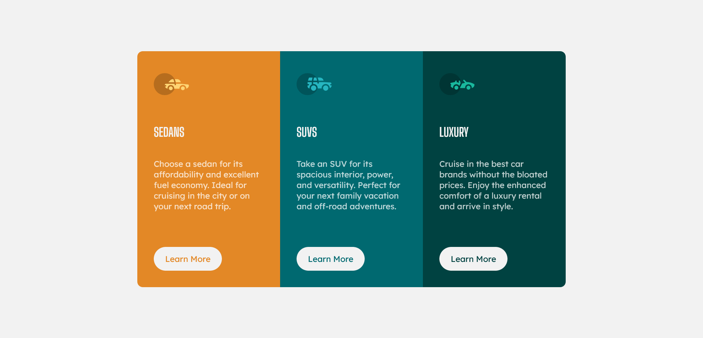

# Frontend Mentor - 3-column preview card component solution

This is a solution to the [3-column preview card component challenge on Frontend Mentor](https://www.frontendmentor.io/challenges/3column-preview-card-component-pH92eAR2-). Frontend Mentor challenges help you improve your coding skills by building realistic projects. 

## Table of contents

- [Overview](#overview)
  - [The challenge](#the-challenge)
  - [Screenshot](#screenshot)
  - [Links](#links)
- [My process](#my-process)
  - [Built with](#built-with)
  - [What I learned](#what-i-learned)
  - [Continued development](#continued-development)
  - [Useful resources](#useful-resources)
- [Author](#author)
- [Acknowledgments](#acknowledgments)

**Note: Delete this note and update the table of contents based on what sections you keep.**

## Overview

### The challenge

Users should be able to:

- View the optimal layout depending on their device's screen size
- See hover states for interactive elements

### Screenshot




### Links

- Solution URL: [https://geraldveeneman.github.io/3-column-card/](https://geraldveeneman.github.io/3-column-card/)
- Live Site URL: [Add live site URL here](https://your-live-site-url.com)

## My process

### Built with

- Semantic HTML5 markup
- CSS custom properties
- Flexbox
- Mobile-first workflow

### What I learned

Use this section to recap over some of your major learnings while working through this project. Writing these out and providing code samples of areas you want to highlight is a great way to reinforce your own knowledge.
#### Major learnings
During this project I learned the following:

##### Github

- How to work with GitHub and Visual Studio Code together

- How to create a new repository
- How to create a new branch
- How to clone a repository from GitHub into VS Code
- How to deploy and view a Github Page

##### CSS
- How to use CSS Flexbox
- Using CSS variables (see code example below)
```css
/* Colours */
:root {
    --bright-orange: hsl(31, 77%, 52%);
}

#sedans {
    background-color: var(--bright-orange);
}
```


If you want more help with writing markdown, we'd recommend checking out  to learn more.

**Note: Delete this note and the content within this section and replace with your own learnings.**

### Continued development

Use this section to outline areas that you want to continue focusing on in future projects. These could be concepts you're still not completely comfortable with or techniques you found useful that you want to refine and perfect.

**Note: Delete this note and the content within this section and replace with your own plans for continued development.**

### Useful resources

- [W3Schools CSS Flexbox](https://www.w3schools.com/css/css3_flexbox.asp) - This helped me to understand how to use CSS Flexbox. I really like this site and will use it going forward.
- [W3Schools CSS Variables](https://www.w3schools.com/css/css3_variables.asp)
 This helped me to understand how to use CSS Variables. During this project I defined the different used colours using CSS variables. 
- [Sanitize.css](https://github.com/csstools/sanitize.css/) - a CSS library that provides consistent, cross-browser default styling of HTML elements alongside useful defaults.
It is developed alongside normalize.css, which means every normalization is included, and every normalization and opinion are clearly marked and documented.
- [How to use Flexbox to create a modern CSS card design layout](https://getflywheel.com/layout/flexbox-create-modern-card-design-layout/)
A great article that explains in detail how you can create a responsive card design layout using CSS Flexbox.
- [The Markdown Guide](https://www.markdownguide.org/)
The official Markdown Guide.


## Author

- Website - [Gerald Veeneman](https://www.your-site.com)
- Frontend Mentor - [@yourusername](https://www.frontendmentor.io/profile/yourusername)
- Twitter - [@yourusername](https://www.twitter.com/yourusername)

**Note: Delete this note and add/remove/edit lines above based on what links you'd like to share.**

## Acknowledgments

This is where you can give a hat tip to anyone who helped you out on this project. Perhaps you worked in a team or got some inspiration from someone else's solution. This is the perfect place to give them some credit.

**Note: Delete this note and edit this section's content as necessary. If you completed this challenge by yourself, feel free to delete this section entirely.**
